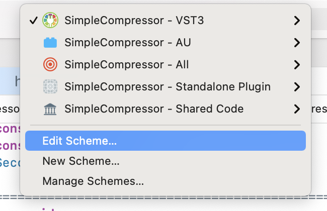
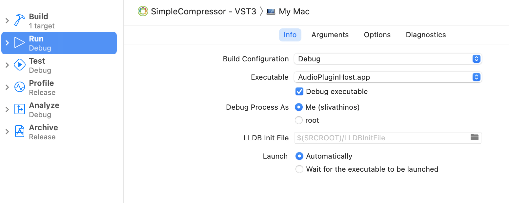
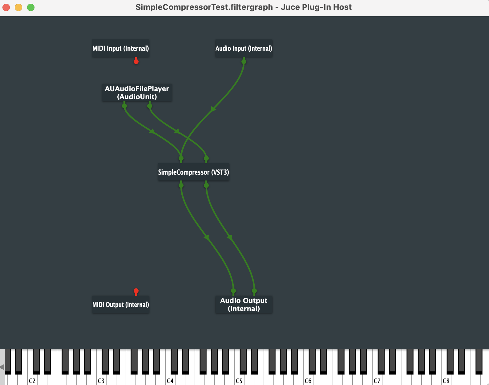

# Single band audio compressor VST plugin

A basic single band compressor for use as a VST plugin made with the JUCE framework.

## Running and debugging

### Installation
In order to compile and debug this plugin, you will need to install [JUCE](https://juce.com/get-juce/download)
and an IDE that is compatible with it. e.g. if on MacOS, install [XCode](https://developer.apple.com/xcode/).

#### Fetch the code
Clone the repo

```
> cd ~/development
> git clone https://github.com/livathinos/simple-compressor-vst
```

### Testing

In order to run the test bed you will need to set up your JUCE environment with an Audio Host and wire that up with
your build process through e.g. XCode. There is already a binary .app file included in this repo to run the test bed
if you are developing on MacOSX. If you are on a different environment, follow [Set up plug-in debugging (optional)](https://docs.juce.com/master/tutorial_create_projucer_basic_plugin.html).

#### Wire up the AudioHostPlugin to XCode

After opening the project in XCode, select edit scheme and add the `AudioPluginHost.app` exectuable to be invoked when
debugging a build. The executable is located under `testbed/MacOSX/AudioPluginHost.app`.






#### Running in debug mode

After the testbed setup is done, run the project in debug mode. To test the compressor you will need to connect the plugin
component with your audio output and some kind of audio input. You can see an example testing setup below:


